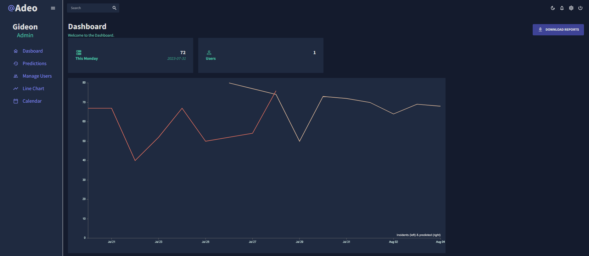

# Incidence-project

At the heart of this project is a time series model trained to predict ETL pipeline failures each week. 
While this is a Machine Learning project, the accompanying fullstack app makes the model easy to use and retrain.

## App Installation.
1. Clone Repository
```git clone {insert github repo url}```
2. Make build.sh executable
```chmod +x ./scripts/build.sh```

There is already a super user account set up to authenticate to all the relevant services.

## Seeding the analytical database
The data comes from a bigquery table in the datawarehouse.
1. Create a .env file in the `backend` folder. Add the values for `CREDENTIAL_KEY_PATH` and `GCP_PROJECT`.
2. Run the `./scripts/seed.sh` script.

## Model Training
Once the database is seeded, the model can be trained by using this script:
`./scripts/model_training.sh`

## Homepage

